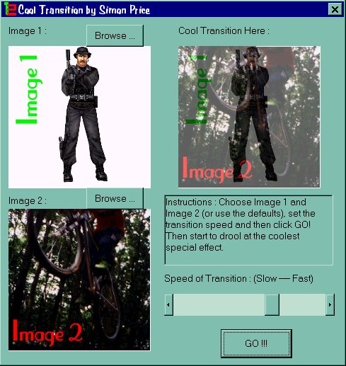



## A COOL TRANSTITION EFFECT\! \(Alpha blending without DirectX\)

### Description

COOL SPECAIL EFFECT - SEE IT TO BELIEVE IT! This is a cool transition effect. There is a scroll bar to adjust the quality/speed of the effect. You can choose your own pictures for the effect too. I've seen a load of special effects ideas on PSC and so I thought of a different idea for a change (since I had seen alot of similar ideas there). I saw that DirectX can do something called alpha-blending and I wondered if it were possible to do it WITHOUT DirectX at a sensible speed in real time. Well, it is! - but (there's always a catch) to do it fast I had to make loads of memory buffers and look-up tables and so it takes 1.44 MB RAM, but that's no problem for most computers. The code is totally, fully commented, so anyone can understand it. Remember to vote for this if you think it's cool/original/well programmed/helpful (ofcourse I reckon it's all four!).
 
### More Info
 

             |
---                |---
**Submitted On**   |2000-07-10 17:57:32
**By**             |[Simon Price](https://github.com/Planet-Source-Code/PSCIndex/blob/master/ByAuthor/simon-price.md)
**Level**          |Beginner
**User Rating**    |4.6 (152 globes from 33 users)
**Compatibility**  |VB 3\.0, VB 4\.0 \(16\-bit\), VB 4\.0 \(32\-bit\), VB 5\.0, VB 6\.0, VB Script, ASP \(Active Server Pages\) 
**Category**       |[Graphics](https://github.com/Planet-Source-Code/PSCIndex/blob/master/ByCategory/graphics__1-46.md)
**World**          |[Visual Basic](https://github.com/Planet-Source-Code/PSCIndex/blob/master/ByWorld/visual-basic.md)
**Archive File**   |[CODE\_UPLOAD76437102000\.zip](https://github.com/Planet-Source-Code/simon-price-a-cool-transtition-effect-alpha-blending-without-directx__1-9646/archive/master.zip)

